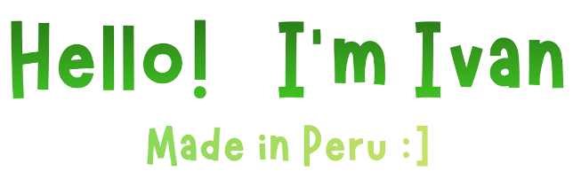

<h1 align="center">
  
</h1>
<h3>A passionate BackEnd Developer (I'm also learning frontend development 🥲) </h3>

**About me**

<ul style="margin: 20px auto; padding: 20px; max-width: 600px; list-style-type: none;">
  <li style="margin-bottom: 10px;">📓 I'm a Software Engineering student at the University of San Marcos </img>.</li>
  <li style="margin-bottom: 10px;">🙏 I enjoy coding in Java, especially with Spring Boot </img>.</li>
  <li style="margin-bottom: 10px;">💪 Always available to develop and help.
  <li style="margin-bottom: 10px;">💬 Ask me about anything <a href="https://github.com/NunezIvan/NunezIvan/issues">here</a>.</li>
  <li style="margin-bottom: 10px;">📫 Email: <strong>nunezivan124@gmail.com</strong> .</li>
</ul>

**Things I code with**

  
  
  
  
  
  
  
  
  
  
  
  
  
  
  
  
  
  

<h3 align="center">Certifications:</h3>

  

<h3 align="center">More certifications coming soon....</h3>

<h3>Where to find me</h3>

   
   

